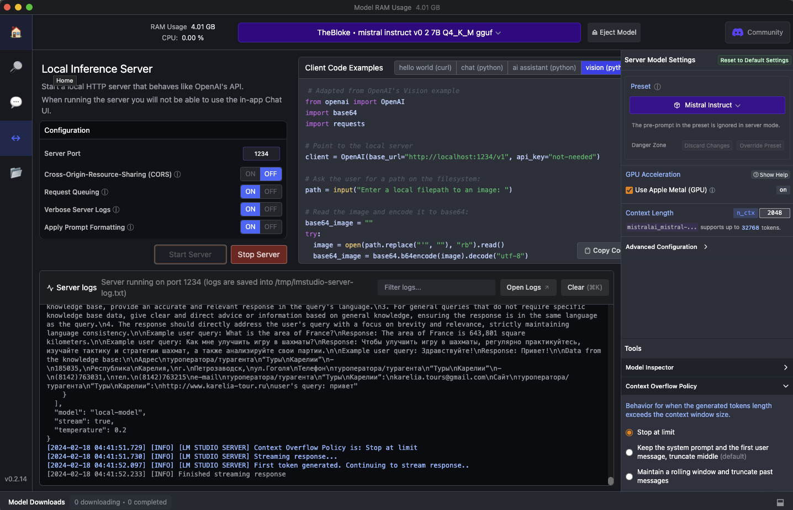

[![Contributors][contributors-shield]][contributors-url]
[![Forks][forks-shield]][forks-url]
[![Stargazers][stars-shield]][stars-url]
[![Issues][issues-shield]][issues-url]
[![MIT License][license-shield]][license-url]


<!-- PROJECT LOGO -->
<br />
<div align="center">
  <a href="https://github.com/RomiconEZ/README-Template">
    
  </a>

  <h3 align="center">KareliaTourBot</h3>

  <p align="center">
    Путешествуй по Карелии вместе с нами!
    <br />
    <br />
    <a href="https://github.com/RomiconEZ/README-Template/issues">Report Bug</a>
    ·
    <a href="https://github.com/RomiconEZ/README-Template/issues">Request Feature</a>
  </p>
</div>


<!-- TABLE OF CONTENTS -->
<details>
  <summary>Table of Contents / Содержание</summary>
  <ol>
    <li>
      <a href="#about-the-project--о-проекте">About The Project / О проекте</a>
      <ul>
        <li><a href="#built-with--технологический-стек">Built With / Технологический стек</a></li>
      </ul>
    </li>
    <li>
      <a href="#getting-started--начало">Getting Started / Начало</a>
      <ul>
        <li><a href="#prerequisites">Prerequisites</a></li>
        <li><a href="#installation--установка">Installation / Установка</a></li>
      </ul>
    </li>
    <li><a href="#license">License</a></li>
    <li><a href="#contact--контакты">Contact / Контакты</a></li>
  </ol>
</details>


<!-- ABOUT THE PROJECT -->
## About The Project / О проекте

Link to project in GitHub: https://github.com/RomiconEZ/Telegram-RAG-bot

Данный проект создан в рамках МегаШколы ИТМО по треку ИИ.
Разработан работающий прототип RAG-системы, который демонстрирует улучшение качества ответов с помощью методов извлечения информации из внешних источников данных. 
Прототип представлен в виде кода с документацией, включая инструкции по установке, настройке и использованию системы.
Также прилагается видео демо работы сервиса.

Данный бот является продолжение идеи, представленной в презентации ко 2-ому заданию.

В качестве LLM используется локально развернутая IlyaGusev/saiga_mistral_7b_gguf с помощью LM studio

В качестве модели для эмбеддингов используется "sentence-transformers/all-MiniLM-L6-v2"

Chroma используется для создания и использования векторного представления текстовых данных.

LangChain используется для обработки и управления текстовыми данными.

База знаний содержит файл с информацией о туроператоре (все совпадения случайны):

```
Адрес туроператора/турагента “Туры Карелии” - 185035, Республика Карелия, г. Петрозаводск, ул.Гоголя

Телефон туроператора/турагента “Туры Карелии” - (8142)763031, тел. (8142)763215

e-mail туроператора/турагента “Туры Карелии”: karelia.tours@gmail.com 

Сайт туроператора/турагента “Туры Карелии”:  http://www.karelia-tour.ru
```


<p align="right">(<a href="#readme-top">back to top</a>)</p>


### Built With / Технологический стек

* ![Python][Python.com]
* ![Docker][Docker.com]
* 


<p align="right">(<a href="#readme-top">back to top</a>)</p>


<!-- GETTING STARTED -->
## Getting Started / Начало

### Prerequisites
- Docker: https://www.docker.com/get-started
- LM studio: https://lmstudio.ai
- Download the IlyaGusev/saiga_mistral_7b_gguf model in LM studio

### Installation / Установка

1. Clone the repository.

2. Copy the `.env.example` file in the directory and change the name to `.env`. Replace the value of TG_BOT_TOKEN with your bot's token.

3. Launch the server in LM studio



4. In the terminal, navigate to the root directory of the cloned repository. Build the Docker containers with the following command:
   ```shell
   make build
   ```
   To run telegram bot:
   ```shell
   make run
   ```


<!-- LICENSE -->
## License

Distributed under the MIT License.

<p align="right">(<a href="#readme-top">back to top</a>)</p>


<!-- CONTACT -->
## Contact / Контакты

Roman Neronov:
* email: roman.nieronov@gmail.com / roman.nieronov@mail.ru
* telegram: @Romiconchik

<p align="right">(<a href="#readme-top">back to top</a>)</p>


<!-- MARKDOWN LINKS & IMAGES -->
<!-- https://www.markdownguide.org/basic-syntax/#reference-style-links -->
[contributors-shield]: https://img.shields.io/github/contributors/RomiconEZ/Telegram-RAG-bot.svg?style=for-the-badge
[contributors-url]: https://github.com/RomiconEZ/Telegram-RAG-bot/graphs/contributors
[forks-shield]: https://img.shields.io/github/forks/RomiconEZ/Telegram-RAG-bot.svg?style=for-the-badge
[forks-url]: https://github.com/RomiconEZ/Telegram-RAG-bot/network/members
[stars-shield]: https://img.shields.io/github/stars/RomiconEZ/Telegram-RAG-bot.svg?style=for-the-badge
[stars-url]: https://github.com/RomiconEZ/Telegram-RAG-bot/stargazers
[issues-shield]: https://img.shields.io/github/issues/RomiconEZ/Telegram-RAG-bot.svg?style=for-the-badge
[issues-url]: https://github.com/RomiconEZ/Telegram-RAG-bot/issues
[license-shield]: https://img.shields.io/github/license/RomiconEZ/Telegram-RAG-bot.svg?style=for-the-badge
[license-url]: https://github.com/RomiconEZ/Telegram-RAG-bot/blob/master/LICENSE.txt
[product-screenshot]: images/mainlogo.jpg


[Python.com]: https://img.shields.io/badge/Python-14354C?style=for-the-badge&logo=python&logoColor=white

[fastapi.com]: https://img.shields.io/badge/FastAPI-005571?style=for-the-badge&logo=fastapi

[Docker.com]: https://img.shields.io/badge/docker-%230db7ed.svg?style=for-the-badge&logo=docker&logoColor=white

